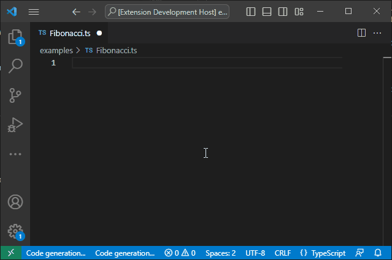
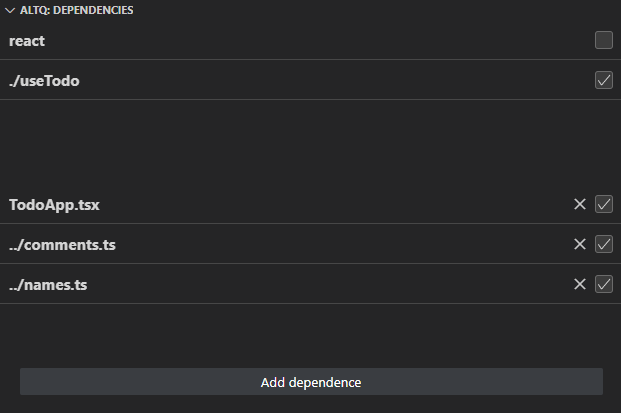

# AltQ v0.0.6

### Say AltQ what you want to do.

### Use any context for you code.

## DISCLAIMER

This is the early alpha version build to demonstrate the proof of concept of AI integration in the development process.

The main goal of the project is to create an assistant who will do all the routine work knowing the context of the project.

## How to

`alt+q` : Displays the request prompt.

Invoke the prompt anywhere and input your request to have the answer pasted at that location.

Select any text and invoke the prompt to make the necessary modifications.

## About

I am AltQ, the AI Programming Assistant. 
I help developers write code quickly and efficiently.

## Features

1. Develop new features
1. Optimize and enhance existing code
1. Acquire knowledge of the current project and provide contextually relevant suggestions.

## Requirements

You must obtain and provide an [OpenAI API key](https://beta.openai.com/account/api-keys).

## Extension Settings

This extension contributes the following settings:

* `AltQ > API Key`: Your OpenAI API Key.
* `AltQ > Stream Request`: **(Experimental)** Use the OpenAI API stream to receive partial answers instead of waiting for the entire response. The API is unstable and frequently malfunctions but looks cool.

## Known Issues

This is an early alpha version build to demonstrate the proof of concept of AI integration in the development process.

Don't change the cursor position during generation because the answer will be placed there.

Some prompts may produce unexpected results.  
Some errors may appear unexpectedly.

For any questions, ideas and suggestions,  
Please feel free to get in touch.

## Release Notes
### 0.0.6
* Implemented dependencies window.
* Implemented dependencies for ts/js languages.
* Implemented plugin system to work with difference languages.
* Rewritten panel render.

### 0.0.5
Remove codex model support.

### 0.0.4
Updated README with a gif preview.

### 0.0.3
Disabled auto tag closing on HTML.

### 0.0.2
Improved the Last Request panel to display HTML.

### 0.0.1-alpha
Base PoC
